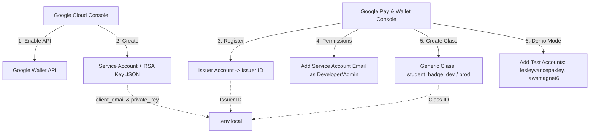

# Google Wallet & Tap-to-Log Attendance Implementation Plan

> **For agentic workers:** REQUIRED SUB-SKILL: Use superpowers:subagent-driven-development (recommended) or superpowers:executing-plans to implement this plan task-by-task. Steps use checkbox (`- [ ]`) syntax for tracking.

**Goal:** Enable a Google Wallet digital membership pass for students with an admin settings toggle, while leaving an extensible PWA Web NFC hook for tap-to-log attendance, maintaining 100% backward compatibility with existing optical QR attendance and zero breaking schema changes.

**Architecture:** Next.js 16 App Router with Supabase PostgreSQL backend. Passes are dynamically minted using a stateless RS256-signed JWT (`node:crypto` standard library, zero new npm dependencies) targeting Google Wallet's Generic Pass specification. Optical camera QR remains the primary production scanner mode; an isolated `useNfcReader` adapter hook is provided for optional NDEF tap-to-log in compatible Android PWA environments.

**Tech Stack:**
- Next.js 16 (React 19, Server Actions, App Router)
- Node.js `node:crypto` (Native RS256 JWT signing)
- Google Wallet REST / JWT Save API (`GenericClass` / `GenericObject`)
- Supabase PostgreSQL (Single boolean column addition to `organization_settings`)
- Vitest (`app/tests/unit/`)
- Web NFC API (`NDEFReader` adapter hook for PWA)

**Spec:** [`docs/google-wallet-feasibility.md`](file:///c:/Users/Hawksprey/source/repos/Alienista-/docs/google-wallet-feasibility.md)

---

## Global Constraints

- Working directory for all commands: `app/` (unless editing Supabase migrations in root).
- TypeScript strict mode: `npx tsc --noEmit` must pass cleanly without warnings.
- All tests must pass: `cd app && npm test`.
- Zero new npm dependencies: use standard library `node:crypto` for JWT signing.
- Minimal SQL changes: Only one single non-breaking column added to `organization_settings` (`google_wallet_enabled boolean default false`).
- Never commit `.env.local` or private keys.
---

## Preparatory Setup: Google Wallet Console Provisioning Guide (Step-by-Step)

Before running the application tasks, the Google Cloud and Google Pay & Wallet consoles must be configured once for your provider (`lesleyvancepaxley@gmail.com` for test, `alienistation@gmail.com` for production).



### Step 1: Google Cloud Console Setup (GCP)
1. Navigate to [Google Cloud Console](https://console.cloud.google.com/) and sign in with your provider email (`lesleyvancepaxley@gmail.com` for dev / `alienistation@gmail.com` for prod).
2. Create or select a project (e.g., `alienista-wallet-sandbox`).
3. In the top search bar, search for **Google Wallet API** and click **Enable**.
4. Go to **IAM & Admin > Service Accounts** and click **+ Create Service Account**:
   * **Name:** `alienista-wallet-sa`
   * **Service account ID:** `alienista-wallet-sa@<project-id>.iam.gserviceaccount.com`
   * Click **Done** (GCP project-level roles can be left empty; permissions are granted directly inside the Wallet Console).
5. Click on the newly created Service Account, open the **Keys** tab, click **Add Key > Create new key**, select **JSON**, and click **Create**.
6. Open the downloaded JSON file. You will need two values for your `.env.local`:
   * `client_email` -> maps to `GOOGLE_WALLET_CLIENT_EMAIL`
   * `private_key` -> maps to `GOOGLE_WALLET_PRIVATE_KEY`

### Step 2: Google Pay & Wallet Console Setup
1. Navigate to the [Google Pay & Wallet Console](https://pay.google.com/business/console) and sign in with the same provider account.
2. Complete initial registration if prompted (Business Name: e.g., "Alienista Student Association").
3. Note your numeric **Issuer ID** displayed at the top or in settings (e.g. `3388000000012345678`). This is `GOOGLE_WALLET_ISSUER_ID`.

### Step 3: Authorize the Service Account (Crucial Linkage)
> [!IMPORTANT]
> A signed JWT will fail with a `403 Forbidden` error unless the GCP Service Account is explicitly added as an authorized user on your Issuer Account.
1. In the Google Pay & Wallet Console left navigation, click **Google Wallet API** (or **Settings > Users**).
2. Look for **Service Accounts** or **Users** and click **Invite user** / **Add Service Account**.
3. Paste your GCP Service Account email (`alienista-wallet-sa@<project-id>.iam.gserviceaccount.com`).
4. Set the role to **Developer** or **Admin** and click **Invite / Save**.

#### Step 4: Provision the Generic Pass Class (`/generic/create`)
Direct link: `https://pay.google.com/business/console/passes/BCR2DN6DVLZMZF25/issuer/3388000000023183187/generic/create`

Fill out the console form fields section-by-section:

| Form Section & Field | Exact Value to Enter / Select | Notes / Rationale |
| :--- | :--- | :--- |
| **General > Class ID \*** | `student_badge_dev` | Console prefixes with `3388000000023183187.` Full ID: `3388000000023183187.student_badge_dev` |
| **General > Multiple devices and holders allowed status** | `One user, multiple devices` (`ONE_USER_ALL_DEVICES`) | Allows student's phone & smartwatch, prevents unauthorized sharing across accounts |
| **Image Modules > Image Module 1 > Image URL** | *Leave Blank* | Dynamic student avatar is injected dynamically in the Next.js pass object |
| **Text Modules > Text Module 1 > Header & Body** | *Leave Blank* | Student Number, Section, and Status are injected dynamically per student by the app |
| **Link Modules > Link Module 1 > Link Label** | `Alienista Portal` | Clickable label on pass details in Google Wallet |
| **Link Modules > Link Module 1 > Link URL** | `https://alienista.vercel.app` (or dev URL) | URL opened when clicking the link |
| **Smart Tap Settings > Enable Smart Tap?** | **NO / Unchecked** | Alienista uses optical camera QR scanning; Smart Tap requires dedicated merchant terminals |
| **Redemption Issuers** | *Leave Blank* | N/A (retail loyalty only) |
| **Callback Settings > Callback URL & Update request URL** | *Leave Blank* | N/A (our signed JWT flow is completely stateless) |

Click **Save class** when complete.

### Step 5: Configure the Test Allowlist (For Demo Mode)
1. While your Issuer account is in **Demo Mode**, Google will reject pass saves from unauthorized Google accounts.
2. In the Google Pay & Wallet Console, go to **Google Wallet API > Test accounts**.
3. Click **Add test account** and add:
   * `lesleyvancepaxley@gmail.com`
   * `lawsmagnet6@gmail.com` (Netorare)
   * Any student test Google accounts you use for testing.
4. Click **Save**. Those specific accounts can now save and view the test pass without receiving a demo restriction error.

### Step 6: Request Production Publishing Access (When Ready for Prod)
1. Log in with `alienistation@gmail.com`.
2. Under **Publishing status**, click **Request publishing access**.
3. Select **Generic Pass**, provide your app URL, describe it as an academic student organization identification badge, and upload a screenshot of the pass preview.
4. Once approved by Google (typically 1–3 business days), the allowlist restriction is removed and any student with any Google Account can save their badge.

---
---

## File Structure & Map

```
supabase/migrations/
└── 20260905000000_google_wallet_settings.sql   — Single-line migration adding google_wallet_enabled

app/src/
├── lib/
│   ├── badges/
│   │   └── google-wallet.ts                   — Pure stdlib Google Wallet JWT generator (RS256)
│   ├── actions/
│   │   ├── google-wallet.ts                   — Server Action: getStudentGoogleWalletUrlAction
│   │   └── settings.ts                        — Updated to toggle google_wallet_enabled
│   └── types/
│       └── models.ts                          — Updated OrganizationSettings type
├── hooks/
│   └── use-nfc-reader.ts                      — Extensible PWA Web NFC adapter hook
├── components/
│   └── badges/
│       └── badge-card.tsx                     — "Save to Google Wallet" button component
└── app/
    ├── (student)/
    │   └── my-qr/page.tsx                     — Passes Google Wallet URL to BadgeCard
    └── (dashboard)/
        ├── settings/
        │   └── settings-view.tsx              — Admin toggle for Google Wallet feature
        ├── students/
        │   └── student-table.tsx              — Admin pass preview action per student
        └── scanner/
            └── scanner-view.tsx               — NFC adapter integration with QR scanner fallback

app/tests/unit/
├── google-wallet.test.ts                      — Unit tests for JWT creation and deterministic IDs
├── settings-google-wallet.test.ts             — Unit tests for admin toggle action
├── badge-wallet-ui.test.ts                    — Tests for component rendering based on toggle
└── nfc-reader.test.ts                         — Unit tests for NDEF scan adapter mapping
```

---

## Tasks

### Task 1: Minimal SQL Migration & Organization Settings Update

**Files:**
- Create: `supabase/migrations/20260905000000_google_wallet_settings.sql`
- Modify: `app/src/lib/types/models.ts`
- Modify: `app/src/lib/actions/settings.ts`
- Test: `app/tests/unit/settings-google-wallet.test.ts`

**Interfaces:**
- Consumes: `createAdminClient()`, `getEffectiveOrgId()`, `requireRole('admin')`
- Produces: `toggleGoogleWalletAction(enabled: boolean): Promise<ActionResponse>`

- [ ] **Step 1: Write the failing test for `toggleGoogleWalletAction`**

Create `app/tests/unit/settings-google-wallet.test.ts`:
```typescript
import { describe, it, expect, vi, beforeEach } from 'vitest';
import { toggleGoogleWalletAction } from '@/lib/actions/settings';

const mockFrom = vi.fn();
const mockAdminClient = { from: mockFrom };

vi.mock('@/lib/supabase/admin', () => ({
  createAdminClient: () => mockAdminClient,
  getEffectiveOrgId: vi.fn().mockResolvedValue('org-123'),
}));

vi.mock('@/lib/session', () => ({
  getSessionUser: vi.fn().mockResolvedValue({ id: 'admin-1', role: 'admin', organization_id: 'org-123' }),
}));

vi.mock('next/cache', () => ({
  revalidatePath: vi.fn(),
}));

describe('toggleGoogleWalletAction', () => {
  beforeEach(() => {
    vi.clearAllMocks();
  });

  it('updates google_wallet_enabled in organization_settings', async () => {
    mockFrom.mockReturnValue({
      update: vi.fn().mockReturnValue({
        eq: vi.fn().mockResolvedValue({ error: null }),
      }),
    });

    const res = await toggleGoogleWalletAction(true);
    expect(res.success).toBe(true);
  });

  it('rejects non-admin roles', async () => {
    const { getSessionUser } = await import('@/lib/session');
    vi.mocked(getSessionUser).mockResolvedValueOnce({ id: 'student-1', role: 'student', organization_id: 'org-123' });

    const res = await toggleGoogleWalletAction(true);
    expect(res.success).toBe(false);
    expect(res.error).toMatch(/unauthorized/i);
  });
});
```

- [ ] **Step 2: Run test to verify it fails**

Run: `cd app && npx vitest run tests/unit/settings-google-wallet.test.ts -v`
Expected: FAIL (cannot find module / function `toggleGoogleWalletAction`)

- [ ] **Step 3: Create migration & implement the settings toggle action**

Create `supabase/migrations/20260905000000_google_wallet_settings.sql`:
```sql
-- Minimal additive migration: add Google Wallet feature switch
ALTER TABLE public.organization_settings
  ADD COLUMN IF NOT EXISTS google_wallet_enabled BOOLEAN NOT NULL DEFAULT false;
```

Update `app/src/lib/types/models.ts` inside `OrganizationSettings`:
```typescript
export interface OrganizationSettings {
  id: string;
  organization_id: string;
  academic_year: string;
  semester: Semester;
  admin_username?: string;
  sanctions_enabled?: boolean;
  google_wallet_enabled?: boolean;
  updated_at: string;
}
```

In `app/src/lib/actions/settings.ts`, export `toggleGoogleWalletAction`:
```typescript
export async function toggleGoogleWalletAction(enabled: boolean): Promise<ActionResponse> {
  const user = await getSessionUser();
  if (!user || user.role !== 'admin') return { success: false, error: 'Unauthorized.' };

  const orgId = await getEffectiveOrgId(user.organization_id);
  const admin = createAdminClient();

  const { error } = await admin
    .from('organization_settings')
    .update({ google_wallet_enabled: enabled, updated_at: new Date().toISOString() })
    .eq('organization_id', orgId);

  if (error) return { success: false, error: error.message };
  revalidatePath('/settings');
  revalidatePath('/my-qr');
  return { success: true, data: undefined, message: `Google Wallet passes ${enabled ? 'enabled' : 'disabled'}.` };
}
```
Also update `getSettingsDataAction` select clause in `settings.ts` to include `google_wallet_enabled`.

- [ ] **Step 4: Run test to verify it passes**

Run: `cd app && npx vitest run tests/unit/settings-google-wallet.test.ts -v`
Expected: PASS

- [ ] **Step 5: Commit**

```bash
git add supabase/migrations/20260905000000_google_wallet_settings.sql app/src/lib/types/models.ts app/src/lib/actions/settings.ts app/tests/unit/settings-google-wallet.test.ts
git commit -m "feat(settings): add google_wallet_enabled toggle migration and server action"
```

---

### Task 2: Core Google Wallet Pass Minting via `node:crypto` (Pure Stdlib)

**Files:**
- Create: `app/src/lib/badges/google-wallet.ts`
- Create: `app/src/lib/actions/google-wallet.ts`
- Test: `app/tests/unit/google-wallet.test.ts`

**Interfaces:**
- Consumes: `Student`, environment variables (`GOOGLE_WALLET_ISSUER_ID`, `GOOGLE_WALLET_CLASS_ID`, `GOOGLE_WALLET_CLIENT_EMAIL`, `GOOGLE_WALLET_PRIVATE_KEY`)
- Produces:
  * `createGoogleWalletJwtPayload(student: Student, config: WalletConfig): object`
  * `signGoogleWalletJwt(payload: object, privateKeyPem: string): string`
  * `generateGoogleWalletSaveUrl(student: Student): string | null`
  * `getStudentGoogleWalletUrlAction(studentId?: string): Promise<ActionResponse<{ url: string }>>`

- [ ] **Step 1: Write unit tests for JWT generation and QR payload mapping**

Create `app/tests/unit/google-wallet.test.ts`:
```typescript
import { describe, it, expect } from 'vitest';
import crypto from 'node:crypto';
import { createGoogleWalletJwtPayload, signGoogleWalletJwt } from '@/lib/badges/google-wallet';
import type { Student } from '@/lib/types/models';

describe('Google Wallet Pass Generation', () => {
  const mockStudent: Student = {
    id: '123e4567-e89b-12d3-a456-426614174000',
    organization_id: 'org-1',
    uid: '2024-0042',
    student_number: '2024-00042',
    full_name: 'Nestor Jann Asag',
    course: 'BSIT',
    year: '3rd Year',
    section: 'Block A',
    status: 'Active',
    is_first_login: false,
    avatar_url: 'https://example.com/avatar.png',
    created_at: '2026-01-01T00:00:00Z',
    updated_at: '2026-01-01T00:00:00Z',
  };

  const mockConfig = {
    issuerId: '3388000000012345678',
    classId: 'student_badge_dev',
    clientEmail: 'wallet-dev@test.iam.gserviceaccount.com',
    appUrl: 'https://alienista.edu',
  };

  it('creates deterministic generic object id and embeds student.uid in QR barcode', () => {
    const payload = createGoogleWalletJwtPayload(mockStudent, mockConfig);

    expect(payload.iss).toBe(mockConfig.clientEmail);
    expect(payload.typ).toBe('savetowallet');

    const genericObject = payload.payload.genericObjects[0];
    expect(genericObject.id).toBe(`${mockConfig.issuerId}.${mockStudent.id}`);
    expect(genericObject.classId).toBe(`${mockConfig.issuerId}.${mockConfig.classId}`);
    expect(genericObject.barcode).toEqual({
      type: 'QR_CODE',
      value: '2024-0042',
      alternateText: '2024-0042',
    });
    expect(genericObject.header.defaultValue.value).toBe('Nestor Jann Asag');
  });

  it('signs valid RS256 JWT using node:crypto without external libraries', () => {
    const { privateKey, publicKey } = crypto.generateKeyPairSync('rsa', {
      modulusLength: 2048,
    });
    const privateKeyPem = privateKey.export({ type: 'pkcs8', format: 'pem' }) as string;
    const publicKeyPem = publicKey.export({ type: 'spki', format: 'pem' }) as string;

    const payload = createGoogleWalletJwtPayload(mockStudent, mockConfig);
    const token = signGoogleWalletJwt(payload, privateKeyPem);

    const parts = token.split('.');
    expect(parts).toHaveLength(3);

    // Verify signature with public key
    const verifier = crypto.createVerify('RSA-SHA256');
    verifier.update(`${parts[0]}.${parts[1]}`);
    const signature = Buffer.from(parts[2].replace(/-/g, '+').replace(/_/g, '/'), 'base64');
    expect(verifier.verify(publicKeyPem, signature)).toBe(true);
  });
});
```

- [ ] **Step 2: Run test to verify it fails**

Run: `cd app && npx vitest run tests/unit/google-wallet.test.ts -v`
Expected: FAIL (module `@/lib/badges/google-wallet` not found)

- [ ] **Step 3: Implement `google-wallet.ts` and server action**

Create `app/src/lib/badges/google-wallet.ts`:
```typescript
import crypto from 'node:crypto';
import type { Student } from '@/lib/types/models';

export interface GoogleWalletConfig {
  issuerId: string;
  classId: string;
  clientEmail: string;
  appUrl: string;
}

export function base64UrlEncode(data: string | Buffer): string {
  return Buffer.from(data)
    .toString('base64')
    .replace(/=/g, '')
    .replace(/\+/g, '-')
    .replace(/\//g, '_');
}

export function createGoogleWalletJwtPayload(student: Student, config: GoogleWalletConfig) {
  const sectionLabel = student.section ? (student.section.startsWith('Block') ? student.section : `Block ${student.section}`) : 'Block 1';
  return {
    iss: config.clientEmail,
    aud: 'google',
    origins: [config.appUrl],
    typ: 'savetowallet',
    payload: {
      genericObjects: [
        {
          id: `${config.issuerId}.${student.id}`,
          classId: `${config.issuerId}.${config.classId}`,
          cardTitle: { defaultValue: { language: 'en-US', value: 'Student Membership Badge' } },
          header: { defaultValue: { language: 'en-US', value: student.full_name } },
          subheader: { defaultValue: { language: 'en-US', value: `${student.course} - ${student.year}` } },
          hexBackgroundColor: '#1B4332',
          logo: student.avatar_url ? {
            sourceUri: { uri: student.avatar_url },
            contentDescription: { defaultValue: { language: 'en-US', value: student.full_name } }
          } : undefined,
          barcode: {
            type: 'QR_CODE',
            value: student.uid,
            alternateText: student.uid,
          },
          textModulesData: [
            { id: 'student_number', header: 'STUDENT NO.', body: student.student_number },
            { id: 'section', header: 'SECTION', body: sectionLabel },
            { id: 'status', header: 'STATUS', body: student.status },
          ],
        },
      ],
    },
  };
}

export function signGoogleWalletJwt(payload: object, privateKeyPem: string): string {
  const header = { alg: 'RS256', typ: 'JWT' };
  const encodedHeader = base64UrlEncode(JSON.stringify(header));
  const encodedPayload = base64UrlEncode(JSON.stringify(payload));
  const signInput = `${encodedHeader}.${encodedPayload}`;

  const normalizedKey = privateKeyPem.replace(/\\n/g, '\n');
  const signer = crypto.createSign('RSA-SHA256');
  signer.update(signInput);
  const signature = base64UrlEncode(signer.sign(normalizedKey));

  return `${signInput}.${signature}`;
}

export function generateGoogleWalletSaveUrl(student: Student): string | null {
  const issuerId = process.env.GOOGLE_WALLET_ISSUER_ID;
  const classId = process.env.GOOGLE_WALLET_CLASS_ID;
  const clientEmail = process.env.GOOGLE_WALLET_CLIENT_EMAIL;
  const privateKey = process.env.GOOGLE_WALLET_PRIVATE_KEY;
  const appUrl = process.env.NEXT_PUBLIC_APP_URL || 'http://localhost:3000';

  if (!issuerId || !classId || !clientEmail || !privateKey) return null;

  const payload = createGoogleWalletJwtPayload(student, { issuerId, classId, clientEmail, appUrl });
  const jwt = signGoogleWalletJwt(payload, privateKey);
  return `https://pay.google.com/gp/v/save/${jwt}`;
}
```

Create `app/src/lib/actions/google-wallet.ts`:
```typescript
'use server';

import { createAdminClient, getEffectiveOrgId } from '@/lib/supabase/admin';
import { getSessionUser } from '@/lib/session';
import { ActionResponse } from '@/lib/types/actions';
import { Student } from '@/lib/types/models';
import { generateGoogleWalletSaveUrl } from '@/lib/badges/google-wallet';

export async function getStudentGoogleWalletUrlAction(studentId?: string): Promise<ActionResponse<{ url: string }>> {
  const user = await getSessionUser();
  if (!user) return { success: false, error: 'Unauthorized.' };

  const orgId = await getEffectiveOrgId(user.organization_id);
  const admin = createAdminClient();

  // Check if feature is enabled in organization settings and environment
  if (process.env.NEXT_PUBLIC_ENABLE_GOOGLE_WALLET === 'false') {
    return { success: false, error: 'Google Wallet pass feature is disabled.' };
  }

  const { data: settings } = await admin
    .from('organization_settings')
    .select('google_wallet_enabled')
    .eq('organization_id', orgId)
    .maybeSingle();

  if (settings && !settings.google_wallet_enabled && user.role !== 'admin') {
    return { success: false, error: 'Google Wallet pass generation is currently turned off by admin.' };
  }

  const targetId = (user.role === 'admin' && studentId) ? studentId : user.id;

  const { data: student, error } = await admin
    .from('students')
    .select('*')
    .eq('id', targetId)
    .eq('organization_id', orgId)
    .maybeSingle();

  if (error || !student) return { success: false, error: 'Student record not found.' };

  const url = generateGoogleWalletSaveUrl(student as Student);
  if (!url) return { success: false, error: 'Google Wallet server credentials not configured.' };

  return { success: true, data: { url } };
}
```

- [ ] **Step 4: Run test to verify it passes**

Run: `cd app && npx vitest run tests/unit/google-wallet.test.ts -v`
Expected: PASS

- [ ] **Step 5: Commit**

```bash
git add app/src/lib/badges/google-wallet.ts app/src/lib/actions/google-wallet.ts app/tests/unit/google-wallet.test.ts
git commit -m "feat(badges): implement pure node:crypto Google Wallet generic pass JWT minting"
```

---

### Task 3: Student & Admin UI Integration (`/my-qr` & Student Directory)

**Files:**
- Modify: `app/src/components/badges/badge-card.tsx`
- Modify: `app/src/app/(student)/my-qr/page.tsx`
- Modify: `app/src/app/(dashboard)/students/student-table.tsx`
- Test: `app/tests/unit/badge-wallet-ui.test.ts`

**Interfaces:**
- Consumes: `getStudentGoogleWalletUrlAction`, `BadgeCard` props
- Produces: "Save to Google Wallet" button on student badge view & admin student table

- [ ] **Step 1: Write test for BadgeCard Google Wallet button rendering**

Create `app/tests/unit/badge-wallet-ui.test.ts`:
```typescript
import { describe, it, expect } from 'vitest';
import React from 'react';
import { render, screen } from '@testing-library/react';
import { BadgeCard } from '@/components/badges/badge-card';
import type { BadgeStudent } from '@/lib/types/models';

describe('BadgeCard UI', () => {
  const student: BadgeStudent = {
    id: 's-1',
    uid: '2024-001',
    student_number: '2024-00001',
    full_name: 'Test Student',
    course: 'BSIT',
    year: '1st Year',
    section: '1',
    status: 'Active',
    avatar_url: null,
  };

  it('renders Google Wallet button when walletSaveUrl is passed', () => {
    render(<BadgeCard student={student} walletSaveUrl="https://pay.google.com/gp/v/save/test-jwt" />);
    const button = screen.getByRole('link', { name: /save to google wallet/i });
    expect(button).toBeDefined();
    expect(button.getAttribute('href')).toBe('https://pay.google.com/gp/v/save/test-jwt');
  });

  it('does not render Google Wallet button when walletSaveUrl is null or omitted', () => {
    render(<BadgeCard student={student} walletSaveUrl={null} />);
    const button = screen.queryByRole('link', { name: /save to google wallet/i });
    expect(button).toBeNull();
  });
});
```

- [ ] **Step 2: Run test to verify it fails**

Run: `cd app && npx vitest run tests/unit/badge-wallet-ui.test.ts -v`
Expected: FAIL (`walletSaveUrl` prop does not exist on `BadgeCard`)

- [ ] **Step 3: Update `BadgeCard`, `MyQrPage`, and `StudentTable`**

In `app/src/components/badges/badge-card.tsx`, add optional `walletSaveUrl?: string | null` prop and render the button:
```tsx
export function BadgeCard({
  student,
  showDownload = true,
  walletSaveUrl = null,
}: {
  student: BadgeStudent;
  showDownload?: boolean;
  walletSaveUrl?: string | null;
}) {
  // ... existing code ...

  return (
    <div className="bg-white border border-[#E5EBE5] rounded-lg overflow-hidden shadow-md max-w-sm mx-auto">
      {/* existing canvas / image display */}

      <div className="p-3 bg-[#F8FAF9] border-t border-[#E5EBE5] space-y-2">
        {showDownload && (
          <button
            onClick={handleDownload}
            disabled={!badgeDataUrl}
            className="w-full py-2.5 bg-[#2D6A4F] hover:bg-[#1B4332] text-white font-bold rounded-lg text-xs flex items-center justify-center gap-2 transition-colors shadow-xs disabled:opacity-40"
          >
            <Download className="w-4 h-4" />
            <span>Download Badge PNG</span>
          </button>
        )}

        {walletSaveUrl && (
          <a
            href={walletSaveUrl}
            target="_blank"
            rel="noopener noreferrer"
            aria-label="Save to Google Wallet"
            className="w-full py-2 bg-black hover:bg-neutral-800 text-white font-semibold rounded-lg text-xs flex items-center justify-center gap-2 transition-colors shadow-xs"
          >
            <svg className="w-4 h-4" viewBox="0 0 24 24" fill="currentColor">
              <path d="M21 18v1c0 1.1-.9 2-2 2H5c-1.11 0-2-.9-2-2V5c0-1.1.89-2 2-2h14c1.1 0 2 .9 2 2v1h-9c-1.11 0-2 .9-2 2v8c0 1.1.89 2 2 2h9zm-9-2h10V8H12v8zm4-2.5c-.83 0-1.5-.67-1.5-1.5s.67-1.5 1.5-1.5 1.5.67 1.5 1.5-.67 1.5-1.5 1.5z" />
            </svg>
            <span>Save to Google Wallet</span>
          </a>
        )}
      </div>
    </div>
  );
}
```

In `app/src/app/(student)/my-qr/page.tsx`:
```tsx
import { generateGoogleWalletSaveUrl } from '@/lib/badges/google-wallet';

// ...
const { data: settings } = await admin
  .from('organization_settings')
  .select('google_wallet_enabled')
  .eq('organization_id', student.organization_id)
  .maybeSingle();

const isEnabled = process.env.NEXT_PUBLIC_ENABLE_GOOGLE_WALLET !== 'false' && settings?.google_wallet_enabled;
const walletUrl = isEnabled ? generateGoogleWalletSaveUrl(student as Student) : null;

// Pass walletUrl to <BadgeCard student={student as Student} walletSaveUrl={walletUrl} />
```

In `app/src/app/(dashboard)/students/student-table.tsx`:
Add a quick "Wallet Pass" button or preview action in the student row dropdown/dialog that calls `getStudentGoogleWalletUrlAction(student.id)`.

- [ ] **Step 4: Run test to verify it passes**

Run: `cd app && npx vitest run tests/unit/badge-wallet-ui.test.ts -v`
Expected: PASS

- [ ] **Step 5: Commit**

```bash
git add app/src/components/badges/badge-card.tsx app/src/app/(student)/my-qr/page.tsx app/src/app/(dashboard)/students/student-table.tsx app/tests/unit/badge-wallet-ui.test.ts
git commit -m "feat(ui): add Save to Google Wallet button to badge view and admin student table"
```

---

### Task 4: Admin Settings UI Toggle (`/settings`)

**Files:**
- Modify: `app/src/app/(dashboard)/settings/settings-view.tsx`
- Modify: `app/src/lib/actions/settings.ts`

**Interfaces:**
- Consumes: `toggleGoogleWalletAction`, `organization_settings.google_wallet_enabled`
- Produces: Interactive toggle switch in System Settings

- [ ] **Step 1: Add Google Wallet switch to settings-view.tsx**

In `app/src/app/(dashboard)/settings/settings-view.tsx`, locate the section where feature toggles (such as `sanctions_enabled`) are rendered.
Add the Google Wallet Card:
```tsx
<div className="p-4 sm:p-5 rounded-2xl bg-white border border-[#E5EBE5] flex items-center justify-between">
  <div>
    <h3 className="text-sm font-bold text-slate-900">Google Wallet Passes</h3>
    <p className="text-xs text-slate-500 mt-0.5">
      Allow students to save their digital badge directly into Google Wallet.
    </p>
  </div>
  <button
    type="button"
    role="switch"
    aria-checked={googleWalletEnabled}
    onClick={handleToggleGoogleWallet}
    className={`relative inline-flex h-6 w-11 shrink-0 cursor-pointer rounded-full border-2 border-transparent transition-colors duration-200 ease-in-out focus:outline-hidden ${
      googleWalletEnabled ? 'bg-[#2D6A4F]' : 'bg-slate-200'
    }`}
  >
    <span
      className={`pointer-events-none inline-block h-5 w-5 transform rounded-full bg-white shadow-lg ring-0 transition duration-200 ease-in-out ${
        googleWalletEnabled ? 'translate-x-5' : 'translate-x-0'
      }`}
    />
  </button>
</div>
```

- [ ] **Step 2: Connect toggle handler using `useTransition`**

```tsx
const handleToggleGoogleWallet = () => {
  startTransition(async () => {
    const next = !googleWalletEnabled;
    setGoogleWalletEnabled(next);
    const res = await toggleGoogleWalletAction(next);
    if (!res.success) {
      setGoogleWalletEnabled(!next);
      // Show toast or alert
    }
  });
};
```

- [ ] **Step 3: Verify build and unit test suite**

Run: `cd app && npm test`
Expected: All tests pass.

- [ ] **Step 4: Commit**

```bash
git add app/src/app/(dashboard)/settings/settings-view.tsx
git commit -m "feat(settings): add Google Wallet pass toggle control to admin settings view"
```

---

### Task 5: Extensible Scanner Input Architecture & Optional PWA Web NFC Hook

**Files:**
- Create: `app/src/hooks/use-nfc-reader.ts`
- Modify: `app/src/app/(dashboard)/scanner/scanner-view.tsx`
- Test: `app/tests/unit/nfc-reader.test.ts`

**Interfaces:**
- Consumes: `recordScanAction(input: ScanInput)`
- Produces: `useNfcReader({ onScan: (uid: string) => void, enabled: boolean }): { isSupported: boolean, isListening: boolean, error: string | null }`

- [ ] **Step 1: Write unit tests for NFC Reader payload parsing**

Create `app/tests/unit/nfc-reader.test.ts`:
```typescript
import { describe, it, expect } from 'vitest';
import { parseNfcRecordPayload } from '@/hooks/use-nfc-reader';

describe('useNfcReader helper', () => {
  it('extracts student UID from plain text NDEF record', () => {
    const record = {
      recordType: 'text',
      data: new TextEncoder().encode('2024-0042'),
    };
    const uid = parseNfcRecordPayload(record);
    expect(uid).toBe('2024-0042');
  });

  it('extracts student UID from URI record containing uid param', () => {
    const record = {
      recordType: 'url',
      data: new TextEncoder().encode('https://alienista.edu/scan?uid=2024-0099'),
    };
    const uid = parseNfcRecordPayload(record);
    expect(uid).toBe('2024-0099');
  });

  it('returns raw decoded text as fallback', () => {
    const record = {
      recordType: 'unknown',
      data: new TextEncoder().encode('2024-0100'),
    };
    const uid = parseNfcRecordPayload(record);
    expect(uid).toBe('2024-0100');
  });
});
```

- [ ] **Step 2: Run test to verify it fails**

Run: `cd app && npx vitest run tests/unit/nfc-reader.test.ts -v`
Expected: FAIL (`parseNfcRecordPayload` not found)

- [ ] **Step 3: Implement `use-nfc-reader.ts` and attach to `ScannerView`**

Create `app/src/hooks/use-nfc-reader.ts`:
```typescript
'use client';

import { useState, useEffect, useCallback } from 'react';

export interface NdefRecordLike {
  recordType: string;
  data?: ArrayBuffer | DataView;
}

export function parseNfcRecordPayload(record: NdefRecordLike): string | null {
  try {
    if (!record.data) return null;
    const decoder = new TextDecoder();
    const raw = decoder.decode(record.data).trim();

    if (raw.includes('uid=')) {
      try {
        const url = new URL(raw);
        return url.searchParams.get('uid') || raw;
      } catch {
        const match = raw.match(/uid=([^&]+)/);
        if (match) return match[1];
      }
    }
    return raw;
  } catch {
    return null;
  }
}

export function useNfcReader({
  onScan,
  enabled = true,
}: {
  onScan: (uid: string) => void;
  enabled?: boolean;
}) {
  const [isSupported, setIsSupported] = useState(false);
  const [isListening, setIsListening] = useState(false);
  const [error, setError] = useState<string | null>(null);

  useEffect(() => {
    setIsSupported(typeof window !== 'undefined' && 'NDEFReader' in window);
  }, []);

  const startScan = useCallback(async () => {
    if (!isSupported || !enabled) return;
    try {
      // @ts-expect-error Web NFC API type declaration
      const ndef = new window.NDEFReader();
      await ndef.scan();
      setIsListening(true);
      setError(null);

      // @ts-expect-error Web NFC reading event
      ndef.onreading = (event: { message: { records: NdefRecordLike[] } }) => {
        for (const record of event.message.records) {
          const uid = parseNfcRecordPayload(record);
          if (uid) {
            onScan(uid);
            break;
          }
        }
      };

      // @ts-expect-error Web NFC reading error event
      ndef.onreadingerror = () => {
        setError('NFC read error. Please tap again.');
      };
    } catch (err: unknown) {
      setIsListening(false);
      setError((err as Error)?.message || 'Failed to start NFC reader.');
    }
  }, [isSupported, enabled, onScan]);

  return { isSupported, isListening, error, startScan };
}
```

In `app/src/app/(dashboard)/scanner/scanner-view.tsx`:
Add the NFC listener hook alongside the existing camera scanner:
```tsx
const handleNfcScan = useCallback((scannedUid: string) => {
  handleDecodedText(scannedUid);
}, [handleDecodedText]);

const { isSupported: nfcSupported, isListening: nfcListening, startScan: startNfc } = useNfcReader({
  onScan: handleNfcScan,
  enabled: true,
});

useEffect(() => {
  if (nfcSupported && !nfcListening) {
    startNfc().catch(() => {});
  }
}, [nfcSupported, nfcListening, startNfc]);
```
Show an unobtrusive badge in the scanner toolbar: `[NFC Ready]` if supported on Android Chrome, keeping optical camera QR 100% active and functional.

- [ ] **Step 4: Run tests to verify they pass**

Run: `cd app && npx vitest run tests/unit/nfc-reader.test.ts -v`
Expected: PASS

- [ ] **Step 5: Run full test suite and TypeScript verification**

```bash
cd app
npm test
npx tsc --noEmit
```
Expected: All unit tests pass, TypeScript compiler exits with code 0.

- [ ] **Step 6: Commit**

```bash
git add app/src/hooks/use-nfc-reader.ts app/src/app/(dashboard)/scanner/scanner-view.tsx app/tests/unit/nfc-reader.test.ts
git commit -m "feat(scanner): add extensible Web NFC adapter hook for PWA tap-to-log attendance"
```

---

## Execution Handoff

Plan complete and saved to `docs/superpowers/plans/2026-09-05-google-wallet-and-tap-attendance.md`.
Two execution options:

1. **Subagent-Driven (recommended)** — Dispatch fresh subagents per task, review checkpoints between tasks, fast iteration.
2. **Inline Execution** — Execute tasks in this session using executing-plans, batch execution with checkpoints.
